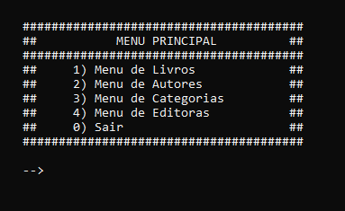

# Biblioteca

> Aplicação desenvolvida em Linguagem C p/ finalidades didáticas

#

### Desenvolvimento

O exercicio prosposto era desenvolver uma aplicação em Linguagem C, para organizar os registros de uma livraria

- [x] Cadastro, Leitura, Alteração e Exclusão dos Livros
- [x] Cadastro, Leitura, Alteração e Exclusão dos Autores
- [x] Cadastro, Leitura, Alteração e Exclusão dos Categorias
- [x] Cadastro, Leitura, Alteração e Exclusão dos Editoras

#

## 💻 Tecnologias utilizadas:

 

    

Para testar este projeto, basta baixar o código ou clonar este repositório e compilar usando o GCC/MinGW</a>

#

## 😄 Obrigado pela presença 

Muito obrigado por reservar um pouco do seu precioso tempo averiguando este projeto, pra você pode não ser muito, mas para mim é um enomre passo na minha carreira ❤

[⬆ Voltar ao topo](#Biblioteca) 
